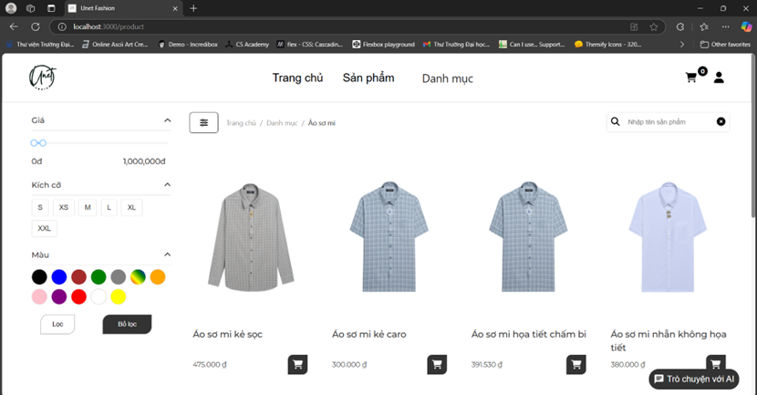

#Running [Backend](https://github.com/tunglam1803/doantotnghiep-be)

# UnetFashion---Fashion-Store---ReactJS
Phân tích thiết kế hệ thống - MSIS3303.N22
This is the final project of the System Analysis and Design course of the Information University. Based on the knowledge we have learned to design systems as well as business processes, we have also developed a website for the Demo part.

## Demo

Insert gif or link to demo
- Still not have a proper domain
- http://3.112.219.18:3000/

- ## :framed_picture: Screenshot

## :checkered_flag: Illustrations

